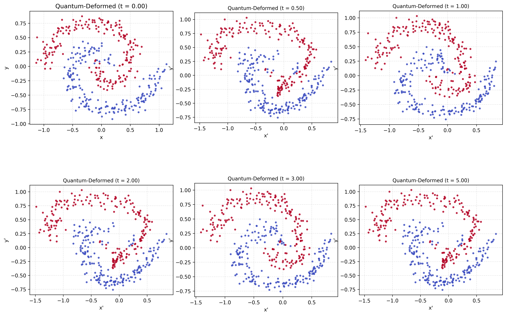

# Quantum Decision Flow v2.1

*A quantum-inspired geometric transformation toolkit that applies Hamiltonian time evolution to classical datasets.*

[](https://www.python.org/downloads/)
[](https://opensource.org/licenses/MIT)
[](https://scholar.google.com/citations?user=tvwpCcgAAAAJ)
[](https://huggingface.co/Cohaerence)

[](https://x.com/coherence)
[](https://www.christopheraltman.com)
[](https://www.linkedin.com/in/Altman)
<!-- [](https://doi.org/10.5281/zenodo.XXXXXXX) -->

Quantum Decision Flow applies small quantum circuits as dynamical systems: classical points are encoded into two-qubit quantum states, evolved under a chosen Hamiltonian, and decoded back into deformed coordinates via expectation values. The result is a controllable family of topology-aware dataset deformations parameterized by evolution time t and Hamiltonian type. Different Hamiltonians produce distinct deformation signatures and topology-preservation statistics, enabling “dynamics-as-augmentation” for geometric learning tasks.

---

## Project Structure

```
quantum-decision-flow/
├── src/
│   ├── __init__.py              # Package exports and version
│   ├── deformation.py           # Core quantum deformation engine
│   │   ├── HamiltonianType      # Enum: ZZ_X, HEISENBERG, ISING, XXZ
│   │   ├── create_hamiltonian() # Hamiltonian factory
│   │   ├── make_expectation_circuit()  # Circuit factory (fixes H parameter bug)
│   │   ├── t2_expectations()    # Quantum expectation values
│   │   ├── xy_to_angles()       # Cartesian → spherical encoding
│   │   ├── deform_points()      # Main deformation function
│   │   ├── compute_deformation_field() # Vector field visualization
│   │   └── estimate_topology_preservation() # k-NN metric
│   ├── generator.py             # Dataset generation
│   │   ├── DatasetType          # Enum: MOONS, CIRCLES, SPIRALS, CONCENTRIC_MOONS
│   │   ├── QuantumMoonsConfig   # Configuration dataclass
│   │   ├── generate_classical_dataset()
│   │   ├── generate_quantum_deformed_moons()
│   │   ├── save_dataset()
│   │   └── load_dataset()
│   └── visualization.py         # Plotting utilities
│       ├── plot_moons_grid()
│       ├── plot_deformation_field()
│       ├── plot_deformation_comparison()
│       ├── plot_statistics()
│       └── plot_topology_preservation()
├── tests/
│   ├── __init__.py
│   ├── test_deformation.py      # 28 unit tests
│   ├── test_generator.py        # 18 unit tests
│   └── test_visualization.py    # 8 unit tests
├── notebooks/
│   └── quantum-decision-flow.ipynb
├── requirements.txt             # Pinned dependencies
├── README.md                    # This file
├── CHANGELOG.md                 # Version history and migration guide
├── PHYSICS_NOTES.md             # Theoretical background and experimental results
├── CORRECTIONS.md               # Original bug fixes documentation
├── QUICK_REFERENCE.md           # API cheatsheet
├── run_comparison.py            # Hamiltonian comparison experiment (v2.1)
├── run_spiral_viz.py            # Spiral + Heisenberg visualization script
├── test_periodicity.py          # Extended periodicity hypothesis test
└── test_corrections.py          # Legacy validation script
```

## Installation

```bash
git clone https://github.com/christopher-altman/quantum-decision-flow.git
cd quantum-decision-flow
pip install -r requirements.txt
```

**Note:** Use `python3` to avoid NumPy/matplotlib version conflicts.

## Quick Start

```python
from src.generator import QuantumMoonsConfig, DatasetType, generate_quantum_deformed_moons
from src.deformation import HamiltonianType
from src.visualization import plot_moons_grid
import matplotlib.pyplot as plt

# Generate spiral data with Heisenberg dynamics
cfg = QuantumMoonsConfig(
    n_samples=400,
    dataset_type=DatasetType.SPIRALS,
    hamiltonian_type=HamiltonianType.HEISENBERG,
    t_values=(0.0, 0.5, 1.0, 2.0, 3.0, 5.0)
)

X_base, y, X_t, metrics = generate_quantum_deformed_moons(cfg, compute_metrics=True)

# Visualize
fig = plot_moons_grid(X_base, y, X_t)
plt.savefig("output.png", dpi=300)
```

## Key Features

### Multiple Hamiltonians
| Type | Formula | Character |
|------|---------|-----------|
| `ZZ_X` | Z₀Z₁ + X₀ | Non-integrable, Rabi oscillations |
| `HEISENBERG` | X₀X₁ + Y₀Y₁ + Z₀Z₁ | Integrable, SU(2) symmetric |
| `ISING_TRANSVERSE` | Z₀Z₁ + hX₀ + hX₁ | Phase transition at h≈1 |
| `XXZ` | X₀X₁ + Y₀Y₁ + ΔZ₀Z₁ | Tunable anisotropy |

### Multiple Dataset Types
| Type | Description |
|------|-------------|
| `MOONS` | Two interleaving half-circles |
| `CIRCLES` | Concentric circles |
| `SPIRALS` | Interleaving Archimedean spirals |
| `CONCENTRIC_MOONS` | Multiple nested moon pairs |

### Topology Preservation Metrics
Quantify how deformation affects local neighborhood structure:

```python
from src.deformation import estimate_topology_preservation
score = estimate_topology_preservation(X_original, X_deformed, k=5)
# Returns 0-1: 1.0 = perfect preservation
```

## Experimental Finding: Hamiltonian Dynamics Differentiation

Different Hamiltonians produce **measurably different** topology preservation patterns:

| Hamiltonian | Mean | Std | Behavior |
|-------------|------|-----|----------|
| ZZ+X (ZZ_X) | 0.817 | 0.034 | Higher variance, distinct phase behavior |
| Heisenberg (HEISENBERG) | 0.828 | 0.025 | More stable; near-zero correlation with ZZ+X (ZZ_X) |

**Correlation between Hamiltonians: -0.064** → effectively uncorrelated dynamics.

See `PHYSICS_NOTES.md` for detailed analysis.

## Physics (Rendered)

### Encoding
<p align="center">
  <picture>
    <source media="(prefers-color-scheme: dark)"
      srcset="https://latex.codecogs.com/svg.image?%5Cdpi%7B120%7D%20%5CLarge%20%5Ccolor%7Bwhite%7D%20(x%2Cy)%5Cto(%5Ctheta%2C%5Cphi)%5Cto%7C%5Cpsi%5Crangle%3DR_Y(%5Ctheta)R_Z(%5Cphi)%7C0%5Crangle_0%5Cotimes%20R_Y(%5Ctheta)R_Z(-%5Cphi)%7C0%5Crangle_1">
    (theta,phi)->|psi> encoding via RY,RZ on two qubits">
  </picture>
</p>

### Time Evolution (Trotterization)
<p align="center">
  <picture>
    <source media="(prefers-color-scheme: dark)"
      srcset="https://latex.codecogs.com/svg.image?%5Cdpi%7B120%7D%20%5CLarge%20%5Ccolor%7Bwhite%7D%20U(t)%5Capprox%5Cleft%5B%5Cexp(-iHt%2Fn)%5Cright%5D%5En%2C%5Cquad%20n%3D%5Cmax(2%2C10%7Ct%7C)">
    
  </picture>
</p>

### Deformation
<p align="center">
  <picture>
    <source media="(prefers-color-scheme: dark)"
      srcset="https://latex.codecogs.com/svg.image?%5Cdpi%7B120%7D%20%5CLarge%20%5Ccolor%7Bwhite%7D%20x%27%3Dx%2B%5Calpha%5Clangle%20Z_0%5Crangle%2C%5Cquad%20y%27%3Dy%2B%5Cbeta%5Clangle%20Z_0Z_1%5Crangle%2B%5Cgamma%5Clangle%20Z_1%5Crangle">
    
  </picture>
</p>

---

### Example: Hamiltonian-Induced Manifold Deformation

The deformation rule above is applied pointwise to a two-spiral dataset as time evolution progresses.

<p align="center">
  
</p>

<p align="center"><em>
Quantum deformation of a two-spiral dataset under Heisenberg time evolution. Panels show the induced coordinate deformation as t increases; deformation remains structured and largely topology-preserving across the sweep.
</em></p>

---

## Testing

```bash
python3 -m pytest tests/ -v
# 54 tests, 100% pass rate
```

## Run Hamiltonian Comparison

```bash
python3 run_comparison.py
```

Outputs topology preservation scores for ZZ+X vs Heisenberg across t ∈ [0.5, 5.0].

## Requirements

- Python 3.10+
- PennyLane 0.36-0.39
- NumPy <2.0
- Matplotlib, scikit-learn, scipy

## Version History

- **v2.1.0**: Fixed Hamiltonian parameter bug (circuit factory pattern)
- **v2.0.0**: Multiple Hamiltonians, dataset types, topology metrics
- **v1.0.0**: Initial release

---

## References

1. C. Altman, J. Pykacz & R. Zapatrin, “Superpositional Quantum Network Topologies,” *International Journal of Theoretical Physics* 43, 2029–2041 (2004).
   DOI: [10.1023/B:IJTP.0000049008.51567.ec](https://doi.org/10.1023/B:IJTP.0000049008.51567.ec) · arXiv: [q-bio/0311016](https://arxiv.org/abs/q-bio/0311016)

2. C. Altman & R. Zapatrin, “Backpropagation in Adaptive Quantum Networks,” *International Journal of Theoretical Physics* 49, 2991–2997 (2010).  
   DOI: [10.1007/s10773-009-0103-1](https://doi.org/10.1007/s10773-009-0103-1) · arXiv: [0903.4416](https://arxiv.org/abs/0903.4416)

---

## Citations

If you use or build on this work, please cite:

> Quantum Decision Flow 2.1

```bibtex
@software{quantum_decision_flow_2_1,
  author = {Altman, Christopher},
  title  = {Quantum Decision Flow 2.1},
  year   = {2025},
  url    = {https://github.com/christopher-altman/quantum-decision-flow}
}
```

## License

MIT License. See [LICENSE](LICENSE) for details.

---

## Contact

- **Website:** [christopheraltman.com](https://christopheraltman.com)
- **Research portfolio:** https://lab.christopheraltman.com/
- **Portfolio mirror:** https://christopher-altman.github.io/
- **GitHub:** [github.com/christopher-altman](https://github.com/christopher-altman)
- **Google Scholar:** [scholar.google.com/citations?user=tvwpCcgAAAAJ](https://scholar.google.com/citations?user=tvwpCcgAAAAJ)
- **Email:** x@christopheraltman.com

---

*Christopher Altman (2025)*

